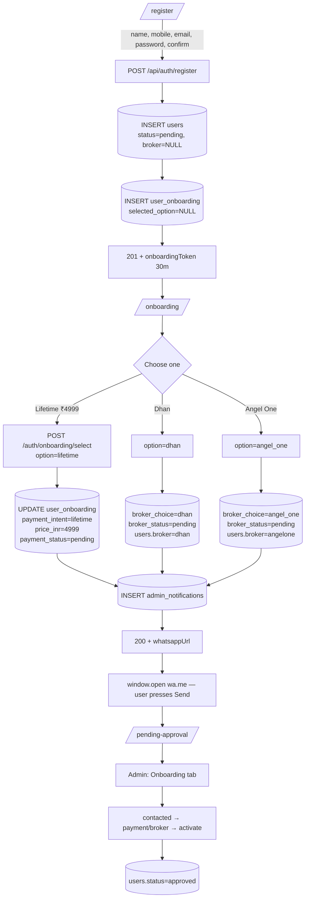

# Vega Analysis — Architecture Audit & Implementation Plan

**Status: ANALYSIS ONLY. No code has been changed.**
Date of audit: 2026-08-06 · Branch: `redesign/premium-fintech-site` @ `ac35a55`

---

# PART 1 — COMPLETE ARCHITECTURE REPORT

## 1.0 Topology

```
client/  React 18 + Vite 5 + Tailwind 3 + lightweight-charts 4 + framer-motion
         dev proxy: /api -> :5000, /ws -> ws://:5000
server/  Node + Express 4 + ws + mysql2 + node-cron + kiteconnect 4
db/      MySQL 8 (vega_analysis), 5 idempotent schema files re-applied every boot
feed/    Zerodha Kite Connect (REST for instrument master, KiteTicker for ticks)
```

Single process. One HTTP server hosts both the REST API and the `/ws/market`
WebSocket. There is no queue, no cache server, no worker pool.

### Boot sequence (`server/src/index.js`)

| # | Step | Failure mode |
|---|---|---|
| 0 | `migrate.run()` — applies all 5 `schema*.sql` | non-fatal, logs |
| 0b | `seedAdmin.run()` | non-fatal |
| 1 | `server.listen(PORT)` | fatal |
| 2 | `startMarketFeed()` → WS server + KiteTicker | non-fatal |
| 2b | `optionStreamService.init(latestTicks)` → also inits `vegaStreamService` | — |
| 3 | `restoreSession()` + `verifySession()` (real `getProfile()` call) | degrades |
| 4 | `instrumentService.refresh(kc)` or `loadFromDatabase()` | degrades |
| 5 | `oiBaselineService` + `vegaTimeseriesService.loadToday()` + `.start()` | degrades |

**Cron jobs (all IST):** `0 8 * * 1-5` session re-check · `15 8 * * 1-5` instrument
refresh · `*/5 * 9-15 * * 1-5` **vega sampler (5-second clock)** · `35 15` OI
baseline · `40 15` ATM IV · `0 3` OAuth reap · `30 3` vega retention purge.

---

## 1.1 Authentication

**Files:** `controllers/authController.js` (566 L) · `middleware/auth.js` ·
`routes/authRoutes.js` · `services/mailService.js` · `config/seedAdmin.js`
**Client:** `context/AuthContext.jsx` · `pages/Login.jsx` · `pages/AdminLogin.jsx` ·
`pages/ForgotPassword.jsx` · `pages/ResetPassword.jsx` · `components/auth/*`
**Tables:** `users`, `login_history`, `password_resets`

- JWT signed with `{ id, email, role, status }`, `JWT_EXPIRES_IN` default `1d`,
  stored in `localStorage` as `vega_token`. No refresh-token rotation is wired
  (`JWT_REFRESH_SECRET` exists in `.env` but is unused).
- **Access is granted by admin approval, not by tier.** `hasMarketAccess(user)`
  in `middleware/auth.js:63` is the single gate, shared by `requirePremium`
  (REST) and the WebSocket upgrade handler. `role === 'admin'` → allow;
  else `status === 'approved'` → allow; legacy tokens with no `status` fall back
  to `role === 'premium'`.
- Password policy `PASSWORD_MIN = 8` + letter + digit, mirrored client-side in
  `PasswordStrength.jsx`. bcrypt cost 12.
- Password reset: SHA-256 of a 32-byte random token stored, raw token emailed
  only, 30-min TTL, single use, generic response to prevent enumeration.
- **A JWT is immutable**: approving a user in the admin panel does not affect
  their already-issued token. They must re-login.

## 1.2 Registration flow (current — to be replaced in Phase 2)

`Register.jsx` collects **name, mobile, email, broker, password** (there is
**no confirm-password field today**).

```
POST /api/auth/register
  → validate (name/email/password/mobile/broker all required)
  → broker whitelisted against BROKERS map (must match users.broker ENUM)
  → INSERT users (role='free', is_active=1, status='pending')
  → 201 { status, message, user:{id,…}, whatsappUrl }
Register.jsx: window.open(whatsappUrl) IMMEDIATELY
  → navigate('/pending-approval', { state })
```

`buildWhatsAppUrl()` (`authController.js:106`) builds a `https://wa.me/<num>?text=`
click-to-chat link (not the Business API — the user presses Send). Message
carries Name / Email / Mobile / Demat Broker / User ID / Account Type /
Registered timestamp / Status. **Never the password.**

`PendingApproval.jsx` re-builds the same message from `GET /api/auth/config`
if the popup was blocked.

**Impacted by Phase 2:** all of the above.

## 1.3 Admin panel

**Files:** `controllers/adminController.js`, `controllers/adminDataController.js`,
`routes/adminRoutes.js`, `services/{auditLog,backup,dataExport,dataRetention}Service.js`
**Client:** `pages/AdminDashboard.jsx` (658 L) + `features/admin/*` (4 panels)
**Tables:** `users`, `login_history`, `admin_audit_log`, `plans`, `subscriptions`

Tabs: Overview (Zerodha panel + System Status + User Management), Data
Management, Purge & Backup, Audit Log, User Activity.

Endpoints: `GET /users`, `PATCH /users/:id/approval|status|role`,
`DELETE /users/:id`, `GET /login-history|live-activity|plans|subscriptions|
system-status|audit-log`, `POST /plans|subscriptions|data/purge|data/backup`,
`GET /data/vega-history|export/csv|export/excel|backups`.

`GET /admin/system-status` is one aggregated, individually-guarded call polled
every 10 s: Zerodha session, ticker health, WS + subscription stats, instrument
master, vega recorder stats, and stored-row counts.

**Impacted by Phase 2:** needs a new Onboarding tab + endpoints.

## 1.4 Zerodha / Kite integration

**Files:** `controllers/zerodhaController.js` (528 L), `services/kiteTickerService.js`,
`services/marketDataService.js`, `utils/{crypto,kiteSessionTime,normalizeTick}.js`
**Tables:** `zerodha_sessions` (AES-encrypted access token), `oauth_states`

- Admin-only OAuth. Nonce persisted in `oauth_states` (survives nodemon
  restarts and multi-worker). Token AES-encrypted with `TOKEN_ENCRYPTION_KEY`.
- `kiteTickerService` owns its own retry policy: exponential backoff 1 s → 60 s
  for network failures; **auth failures stop immediately** and raise
  `health.needsReauth` (this is the fix for the classic 403 reconnect loop).
- `connectTicker` deliberately does **not** clobber the reconciled subscription
  on reconnect; `onConnect` calls `subscriptionManager.resync()`.
- **Hard limits: ~3,000 instrument tokens per connection, 3 connections per API
  key.** Only ONE connection is used today. This is the single most important
  constraint in the whole system for Phases 5–6.

## 1.5 Dhan / Angel One integration

**There is none.** They exist only as `users.broker` ENUM values
(`'zerodha','angelone','dhan','upstox','groww'`), a `BROKERS` label map in
`authController.js:76`, a matching array in `Register.jsx:33`, and a
`BROKER_LABEL` display map in `AdminDashboard.jsx:232`. No SDK, no API key, no
order routing. Phase 2 treats them purely as **lead-routing choices**, which is
consistent with what exists.

## 1.6 WhatsApp integration

`ADMIN_WHATSAPP_NUMBER` in `.env`, digits only with country code. Used in three
places: `authController.buildWhatsAppUrl`, `authController.publicConfig`
(`GET /api/auth/config`), and `publicRoutes` `GET /api/public/site-config`.
Client consumers: `Register.jsx`, `PendingApproval.jsx`, `site/pages/Contact.jsx`,
`site/components/SocialDock.jsx`, `site/hooks/useSiteConfig.js`.

## 1.7 Instrument management

**File:** `services/instrumentService.js` (660 L) · **Table:** `instruments`,
`instrument_refresh_log`

Downloads NSE + BSE + NFO + BFO from Kite (~120k contracts), builds five
in-memory indexes, then persists to MySQL in one transaction (`DELETE` +
chunked 1000-row `INSERT`, never `TRUNCATE`, so a failed refresh rolls back to
yesterday's master).

| Index | Purpose |
|---|---|
| `byToken` | token → row |
| `bySymbol` | tradingsymbol → row |
| `cashByExchangeSymbol` | `'NSE:RELIANCE'` → EQ row (dual-listing disambiguation) |
| `byUnderlying` | key → `{expiries:Set, chains:Map<expiry,Map<strike,{CE,PE}>>, futures:Map}` |
| `searchIndex` | flat array for the search box |
| `derivedUnderlyings` | **every equity F&O name found in the option dump** (~200) |

`buildDerivedConfig()` synthesises a config per stock; the spot token is matched
from the cash segment by `EXCHANGE:SYMBOL`; `inferStrikeStep()` derives the
strike ladder from the listed strikes; lot size from a sample contract.

`listTradableUnderlyings()` = 5 curated indices + every derived name that has
BOTH a resolved `spotToken` AND live expiries. **This is the function
`GET /api/vega/instruments` serves, and therefore the exact seam where the
NIFTY-50 restriction belongs.**

## 1.8 Vega calculation engine

**Files:** `utils/vegaMath.js` (253 L), `utils/blackScholes.js`,
`utils/impliedVolatility.js`, `utils/vegaTrend.js`, `services/optionChainService.js`,
`config/vegaConfig.js`

Pipeline per sample, per `{symbol, expiry}`:

```
latestTicks (Map token→tick)
  → optionChainService.buildChain({symbol, expiry, strikeWindow})
        forward = nearest-future LTP, else S·e^(rT)          ← Black-76
        per contract: impliedVolatility76(LTP) → calculateGreeks76
  → toGreekChain()   keeps only {strike, call:{vega,theta,gamma,delta,iv}, put:{…}}
  → vegaMath.computePoint({currentChain, openChain, start, deltaMax, mode, hysteresis})
        diff1 = ΣcurrentCallVega − ΣopenCallVega
        diff2 = ΣcurrentPutVega  − ΣopenPutVega
        diff3 = diff2 − diff1
  → decorate()  ×DISPLAY_SIGN(−1) + classifyTrend(RAW diffs)
```

**Strike selection** has 3 modes (`VEGA_STRIKE_MODE`), default `stable`:
the basket eligible at day-open is held for the session, with a hysteresis
exit of ±0.15 delta. `dynamic` = the literal `addvega.php` behaviour;
`frozen` = no exit rule.

**Guards that matter:** `isUsableOpenChain()` refuses to freeze a baseline whose
Greeks are >50% null (otherwise every diff for the day becomes `current − 0`);
`computePoint` skips (never zero-fills) a strike whose vega is unsolvable on
either side; strike keys are normalised through `Number()`.

**Delta bands today** (`vegaConfig.DELTA_START` / `STOCK_START`):
NIFTY 0.05 · SENSEX 0.05 · BANKNIFTY/FINNIFTY/MIDCPNIFTY 0.20 · **all stocks 0.20**.
Ceiling `DELTA_MAX = 0.6` everywhere.

**→ Phase 7 is already satisfied for stocks (0.20–0.60).** See §3.7 for the one
inconsistency it exposes.

## 1.9 Historical recorder

**File:** `services/vegaTimeseriesService.js` (1460 L) — the largest and most
important file in the project.
**Tables:** `vega_timeseries`, `vega_day_open`, `vega_chain_snapshots` (optional)

Three axes: **symbol** (any tradable underlying, resolved through
`instrumentService`, not the 5-name constants table) × **expiry** (one immutable
day-open baseline per expiry) × **resolution** (what was WRITTEN — `5s` for both
indices and stocks today).

Per 5-second tick (`runSample`):
1. `ensureSubscriptions()` — **before** the market-window check, so Kite has
   09:00–09:15 to start streaming.
2. Snap `now` to a 5 s boundary with **floor** (node-cron fires up to 962 ms
   late; rounding lost ~2.8 % of samples).
3. For each active target: skip unless `watched` or the tick is aligned to its
   persist resolution → capture day-open if missing → `computeDiffs` →
   `appendLive` (ring buffer, 4,500 points) → collect for `persistSamples`.
4. Batch `INSERT … ON DUPLICATE KEY UPDATE`.
5. Fire `tickListeners` → `vegaStreamService` pushes to browsers.

`sampleInFlight` re-entrancy guard skips a tick rather than queueing —
documented as necessary at 5 s, with `skippedTicks` exposed in `/vega/status`.

**Read path:** `loadByDate(symbol, date, timeframe, expiry)` → today from the
in-memory ring buffer, any other day from MySQL; `pickResolution()` chooses the
finest stored resolution that divides the requested timeframe;
`bucketByTimeframe()` applies last-value-wins per bucket — **the same rule the
live push uses**, which is what makes an all-day chart identical to a reloaded
one.

## 1.10 WebSocket / live streaming

```
Browser                        Server
  marketSocket.js  ──upgrade?token=JWT──▶  websocketService (authenticateUpgrade
                                            + hasMarketAccess, rejects pre-handshake)
  subscribe_vega   ─────────────────────▶  optionStreamService.handleMessage
                                            └─▶ vegaStreamService.handleMessage
                                                  registerDemand(slot,{symbol,expiry})
                                                  subscriptionManager.selectChain(slot)
                                                  ensureSubscriptions()
  ◀── vega_subscribed {points: backfill}
  ◀── vega_point   (one per timeframe bucket advance, from the sampler's own tick)
```

Two independent per-client slots: `client` itself for the option chain,
`client._vegaSlot` for vega, so the two can never release each other's tokens.
`onDisconnect` handlers release both.

`subscriptionManager.reconcile()` unions: always-on index spot tokens +
per-client ref-counted tokens + named standing sets (`'vega-sampler'`), then
calls `kiteTickerService.updateSubscription()` which diffs and
subscribes/unsubscribes.

## 1.11 Timeframe aggregation

`vegaConfig.TIMEFRAMES` = `5s 10s 15s 30s | 1m 3m 5m 10m 15m`.
`canServe(resolution, timeframe)` ⇔ `tf >= res && tf % res === 0`.
Live buffer is always at the 5 s base clock → serves every tier.
History is limited by `storedResolutions`, and `servableTimeframes` is returned
to the client so `TimeframePicker` **disables** (not hides) unusable tiers.

## 1.12 Chart rendering

`VegaChart.jsx` (684 L) — lightweight-charts. Call & Put are **area** series,
Difference is a **line**. Zero price-line on the Call scale. Height derived from
the *viewport* (not the container) via `heightFor()`, capped at 560 px, driven
by an explicit `ResizeObserver` (`autoSize:false`). IST formatting throughout
(the library renders UTC). Append-vs-reset detection avoids a full `setData` on
every live point. Tooltip is clamped inside the plot box.

`PublicVegaChart.jsx` (526 L) is the public variant inside `DelayedVegaPanel`.

## 1.13 Dashboard layout (current)

`features/vegaAnalysis/index.jsx` (1210 L):

```
header (title + Live/Historical + date + expiry pills)
InstrumentSelector + 5 index chips
toolbar (DateNavigator | TimeframePicker | ExpirySelector | Excel)
4 summary tiles (Call / Put / Difference / Trend)
grid 2xl:[1fr_380px]
  ├ grid xl:[13.5rem_1fr]
  │   ├ aside  Session card · Delta filter card · Day open card   ← Phase 4 removes
  │   └ chart
  └ Time-wise Records table (right at ≥1536px, below otherwise)
```

Chart container at 1920 px ≈ `1700 − 380 − 216 − gaps ≈ 1050 px` wide, ~500 px tall,
and it starts **≈ 420 px down the page** — below the fold on a 1080 p laptop.

## 1.14 Hero page (current)

`site/pages/Home.jsx` → `DelayedVegaPanel.jsx`:

```
site-ring
 ├ header (title | 30-Min-Delayed badge | trend pill)
 ├ grid-cols-3 divide-x   ← Call Vega | Put Vega | Difference  (LARGE, full width)
 ├ legend row
 ├ grid lg:[1fr_20.5rem]
 │    ├ PublicVegaChart
 │    └ UnlockCard  ← animated (animate-float-sm), RIGHT column, not centred
 └ premium gate footer
```

Phase 3's complaint is accurate: the three stat cells are a full-width band at
`text-2xl`, and the animated card is pinned right.

## 1.15 Performance-relevant facts observed

- `~240 MB RSS after ~90 minutes` is documented in the code as an observed
  event-loop-starvation incident at the 5 s clock.
- `skippedTicks` counter exists specifically to detect a pass no longer fitting
  in one interval.
- MySQL pool `connectionLimit: 15`, `namedPlaceholders`, `dateStrings: true`.
- `optionStreamService` pushes a full chain rebuild per client per 1000 ms.

---

# PART 2 — FILE-BY-FILE IMPACT ANALYSIS

Legend: **N** new · **M** modified · **—** read-only context

| File | Ph | Impact |
|---|---|---|
| `server/src/schema.onboarding.sql` | 2 | **N** `user_onboarding` + `admin_notifications` |
| `server/src/config/migrate.js` | 2 | **M** add file to `MIGRATIONS` |
| `server/src/schema.sql` | 2 | **M** `users.broker` becomes optional at signup (no DDL change needed — already NULLable) |
| `server/src/controllers/authController.js` | 2 | **M** `register()` drops broker req + adds confirmPassword; new `selectOnboardingOption()`; new `buildOnboardingWhatsAppUrl()`; new `signOnboardingToken()` |
| `server/src/routes/authRoutes.js` | 2 | **M** `POST /onboarding/select`, `GET /onboarding/options` |
| `server/src/middleware/auth.js` | 2 | **M** new `authenticateOnboarding` (scope-limited JWT) |
| `server/src/controllers/onboardingController.js` | 2 | **N** admin list + status transitions |
| `server/src/routes/adminRoutes.js` | 2 | **M** mount 6 onboarding routes |
| `server/src/services/notificationService.js` | 2 | **N** create/list/mark-read admin notifications |
| `client/src/pages/Register.jsx` | 2 | **M** remove broker `<select>`, add Confirm Password, no WhatsApp open, navigate `/onboarding` |
| `client/src/pages/Onboarding.jsx` | 2 | **N** three premium option buttons |
| `client/src/pages/PendingApproval.jsx` | 2 | **M** accept onboarding state |
| `client/src/context/AuthContext.jsx` | 2 | **M** `register()` signature; new `selectOnboardingOption()` |
| `client/src/App.jsx` | 2 | **M** `/onboarding` route |
| `client/src/features/admin/OnboardingPanel.jsx` | 2 | **N** admin onboarding table |
| `client/src/pages/AdminDashboard.jsx` | 2 | **M** add "Onboarding" tab |
| `client/src/site/components/DelayedVegaPanel.jsx` | 3 | **M** relayout: compact side stats + centred card |
| `client/src/site/components/PublicVegaChart.jsx` | 3 | **M** narrower centre column sizing |
| `client/src/features/vegaAnalysis/index.jsx` | 4,6,8 | **M** remove aside; full-width chart; virtualised table; memo split |
| `client/src/features/vegaAnalysis/VegaChart.jsx` | 4,8 | **M** `heightFor()` tiers, axis spacing, tooltip clamp |
| `client/src/features/vegaAnalysis/VegaRecordsTable.jsx` | 4,8 | **N** extracted + windowed |
| `client/src/features/vegaAnalysis/useVegaStream.js` | 6 | **M** keep stale points during switch (no blank) |
| `server/src/constants/nifty50.js` | 5 | **N** the 50 constituents + env override |
| `server/src/services/instrumentService.js` | 5,8 | **M** universe gate + memoised `getStrikeMap`/`getExpiries` |
| `server/src/config/vegaConfig.js` | 5,6,8 | **M** `STOCK_UNIVERSE`, budget defaults, `PERSIST_RESOLUTION` |
| `server/src/services/vegaTimeseriesService.js` | 6,7,8 | **M** budget-aware target ordering, cached open-chain index, lean chain build |
| `server/src/services/optionChainService.js` | 8 | **M** new `buildGreekChain()` lean path |
| `server/src/services/kiteTickerService.js` | 6,8 | **M** multi-connection sharding |
| `server/src/services/subscriptionManager.js` | 6,8 | **M** shard-aware reconcile |
| `server/src/routes/vegaRoutes.js` | 5,6 | **M** `/instruments` reflects universe; `/series` single-query path |
| `server/src/schema.vega.sql` | 8 | **M** optional `PARTITION BY RANGE (snapshot_date)` |

---

# PART 3 — PHASE-BY-PHASE PLAN

## 3.2 Registration redesign

### Database migration (`server/src/schema.onboarding.sql`, new)

```sql
USE vega_analysis;

CREATE TABLE IF NOT EXISTS user_onboarding (
  id                  BIGINT UNSIGNED AUTO_INCREMENT PRIMARY KEY,
  user_id             BIGINT UNSIGNED NOT NULL,
  registration_source VARCHAR(40) NOT NULL DEFAULT 'web',

  selected_option     ENUM('lifetime','dhan','angel_one') DEFAULT NULL,
  payment_intent      ENUM('lifetime')            DEFAULT NULL,
  broker_choice       ENUM('dhan','angel_one')    DEFAULT NULL,
  price_inr           DECIMAL(10,2)               DEFAULT NULL,
  selected_at         DATETIME                    DEFAULT NULL,

  whatsapp_status     ENUM('not_sent','opened','confirmed') NOT NULL DEFAULT 'not_sent',
  whatsapp_opened_at  DATETIME DEFAULT NULL,
  payment_status      ENUM('none','pending','received')     NOT NULL DEFAULT 'none',
  payment_received_at DATETIME DEFAULT NULL,
  broker_status       ENUM('none','pending','completed')    NOT NULL DEFAULT 'none',
  broker_completed_at DATETIME DEFAULT NULL,

  contacted_at        DATETIME DEFAULT NULL,
  activated_at        DATETIME DEFAULT NULL,
  admin_note          VARCHAR(500) DEFAULT NULL,
  handled_by          BIGINT UNSIGNED DEFAULT NULL,

  created_at DATETIME NOT NULL DEFAULT CURRENT_TIMESTAMP,
  updated_at DATETIME NOT NULL DEFAULT CURRENT_TIMESTAMP ON UPDATE CURRENT_TIMESTAMP,

  UNIQUE KEY uq_onboarding_user (user_id),
  FOREIGN KEY (user_id)    REFERENCES users(id) ON DELETE CASCADE,
  FOREIGN KEY (handled_by) REFERENCES users(id) ON DELETE SET NULL,
  INDEX idx_onb_option  (selected_option),
  INDEX idx_onb_payment (payment_status),
  INDEX idx_onb_broker  (broker_status),
  INDEX idx_onb_created (created_at)
) ENGINE=InnoDB;

CREATE TABLE IF NOT EXISTS admin_notifications (
  id         BIGINT UNSIGNED AUTO_INCREMENT PRIMARY KEY,
  type       VARCHAR(40)  NOT NULL,          -- 'onboarding.selected'
  title      VARCHAR(160) NOT NULL,
  body       VARCHAR(600) DEFAULT NULL,
  user_id    BIGINT UNSIGNED DEFAULT NULL,
  payload    JSON DEFAULT NULL,
  is_read    TINYINT(1) NOT NULL DEFAULT 0,
  read_at    DATETIME DEFAULT NULL,
  created_at DATETIME NOT NULL DEFAULT CURRENT_TIMESTAMP,
  FOREIGN KEY (user_id) REFERENCES users(id) ON DELETE CASCADE,
  INDEX idx_notif_unread (is_read, created_at),
  INDEX idx_notif_type   (type)
) ENGINE=InnoDB;

-- Backfill: every existing pending/approved user gets a row so the admin
-- Onboarding tab is not blind to accounts created before this table existed.
INSERT IGNORE INTO user_onboarding (user_id, registration_source, created_at)
SELECT id, 'legacy', created_at FROM users WHERE role <> 'admin';
```

**Reversible.** Rollback = `DROP TABLE user_onboarding, admin_notifications;`
Nothing in `users` is altered — `broker` is already NULLable, which is exactly
what the new step-1 form needs.

### The authorisation problem (important)

A freshly-registered user is `status='pending'` and **cannot log in**, so the
onboarding page has no session. Passing `userId` in the request body would let
anyone set any user's option and spam admin notifications.

**Solution:** `register()` returns a short-lived **scoped JWT**:

```js
jwt.sign({ id, scope: 'onboarding' }, JWT_SECRET, { expiresIn: '30m' })
```

`authenticateOnboarding` accepts it only when `scope === 'onboarding'`, and
`authenticate` rejects any token carrying a `scope` claim — so an onboarding
token can never be used against a data endpoint. It is held in React state /
`sessionStorage`, never `localStorage`.

### New flow



> **Note on ENUM mapping.** `users.broker` accepts `'angelone'` (no underscore).
> `user_onboarding.broker_choice` uses `'angel_one'` exactly as specified. The
> controller maps between them in one place; the two lists must not drift.

### API changes

| Method | Path | Auth | Body / Query | Returns |
|---|---|---|---|---|
| POST | `/api/auth/register` | none | `{name,email,mobile,password,confirmPassword}` | `{status,user,onboardingToken}` — **no `whatsappUrl`** |
| GET | `/api/auth/onboarding/options` | none | — | the 3 options + price, so the page is not hardcoded |
| POST | `/api/auth/onboarding/select` | onboarding JWT | `{option}` | `{ok,selectedOption,whatsappUrl}` |
| POST | `/api/auth/onboarding/whatsapp-opened` | onboarding JWT | — | marks `whatsapp_status='opened'` |
| GET | `/api/admin/onboarding` | admin | `?option=&payment=&broker=&status=&page=` | rows + counts |
| PATCH | `/api/admin/onboarding/:userId` | admin | `{action}` | updated row |
| GET | `/api/admin/notifications` | admin | `?unread=1` | list |
| PATCH | `/api/admin/notifications/:id/read` | admin | — | ok |

`action` ∈ `contacted` · `payment_received` · `dhan_completed` ·
`angel_completed` · `activate` (also sets `users.status='approved'`) ·
`reset_payment` · `reset_broker`. Every transition writes `admin_audit_log`
through the existing `auditLogService`.

### WhatsApp message (new)

```
Hello, I have registered on Vega Analysis.

Name: {name}
Mobile: {mobile}
Email: {email}
User ID: {id}
Registered: {DD MMM YYYY, HH:MM} IST
Selected Option: Lifetime Access — ₹4,999
                 | Open an account with Dhan
                 | Open an account with Angel One

Status: Pending approval
```

Still `wa.me` click-to-chat; the user presses Send. Still no password.

### Onboarding page wireframe

```
┌──────────────────────── AuthShell (max-w-3xl) ────────────────────────┐
│  ✓  Account created — one step to go                                  │
│     Choose how you'd like to get access. Your details go to our team   │
│     on WhatsApp.                                                       │
│                                                                        │
│  ┌────────────────────────────────────────────────────────────────┐   │
│  │ ★  I am ready to pay for Lifetime Access        ₹4,999   →     │   │  gold ring
│  │    One-time. Full terminal, live Vega, all history.            │   │
│  └────────────────────────────────────────────────────────────────┘   │
│  ┌────────────────────────────────────────────────────────────────┐   │
│  │ ◆  I am ready to open an account with Dhan               →     │   │  emerald
│  └────────────────────────────────────────────────────────────────┘   │
│  ┌────────────────────────────────────────────────────────────────┐   │
│  │ ◆  I am ready to open an account with Angel One          →     │   │  emerald
│  └────────────────────────────────────────────────────────────────┘   │
│  Not sure yet? You can decide later — contact us on WhatsApp.         │
└────────────────────────────────────────────────────────────────────────┘
```

Full-width rows, `py-7`, hover lift, disabled + spinner on submit, single
selection wins (guard against double-click double-notification).

---

## 3.3 Hero redesign

Target layout inside `DelayedVegaPanel`:

```
DESKTOP ≥1280
┌───────────────────────────────────────────────────────────────────────┐
│ NIFTY Vega Analysis      [30 Min Delayed ⓘ]      [Bullish]            │
├──────────┬─────────────────────────────────────────┬──────────────────┤
│ CALL VEGA│                                         │  PUT VEGA        │
│  +128.40 │        ┌───────────────────────┐        │   −94.10         │
│ (compact)│        │  Unlock Live Vega     │        │  (compact)       │
├──────────┤        │  Analysis             │        ├──────────────────┤
│  DIFF    │        │  [ Go Live Now → ]    │        │  legend / as-of  │
│  −222.50 │        └───────────────────────┘        │                  │
│          │        (animated, CENTRED, z-10)        │                  │
│          │   ── chart fills the whole width ──     │                  │
└──────────┴─────────────────────────────────────────┴──────────────────┘
grid-cols-[9rem_minmax(0,1fr)_9rem]
```

- Stat cells drop from `text-2xl` → `text-base`, label `text-[10px]`, each
  becomes a small bordered tile in the side rails.
- `UnlockCard` moves to `absolute inset-0 grid place-items-center`
  **over the chart's centre**, `max-w-[22rem]`, keeps `animate-float-sm`.
  ⚠ The current code comment explicitly warns that overlaying the card was
  removed because the curve runs behind it. **Mitigation:** the card gets a
  solid `bg-[rgba(8,13,17,0.94)]` + backdrop blur and the chart gains
  `scaleMargins {top:0.30}` so the curve is pushed into the lower 70 % of the
  pane while the card occupies the upper-middle. This is why it is safe now and
  was not before.
- **No transform on any ancestor of the chart** — lightweight-charts reads
  transformed `getBoundingClientRect()` and mis-sizes its canvas. The existing
  comment in `Home.jsx:67` documents this; the centred card must therefore be a
  sibling overlay, not a wrapper.
- `<1024 px`: rails collapse to a 3-across compact stat row above the chart,
  card returns below it. No overlay on mobile.

---

## 3.4 Vega dashboard redesign

```
DESKTOP ≥1536  (page starts ~140px, chart top ≈ 190px — above the fold)
┌──────────────────────────────────────────────────────────────────────────┐
│ Vega Analysis   [NIFTY ▾][chips]  [◀ 06-08-2026 ▶][Sessions][5s..15m]    │  one row
│                                   [Exp 28-08 ▾][Excel]  Δ 0.20–0.60      │
├──────────────────────────────────────────────────────────────────────────┤
│ Call +128.40 │ Put −94.10 │ Diff −222.50 │ Bullish │ Open 1284/1190      │  one strip
├──────────────────────────────────────────────────────────────────────────┤
│                                                                          │
│                    V E G A   C U R V E                                   │
│              full width, height = 62vh (min 460, max 780)                │
│                                                                          │
├──────────────────────────────────────────────────────────────────────────┤
│ Time-wise Records  (collapsible, windowed, below the chart)              │
└──────────────────────────────────────────────────────────────────────────┘
```

Concrete changes in `features/vegaAnalysis/index.jsx`:

1. **Delete** the `<aside>` (lines 1047–1095): Session card, Delta-filter card,
   Day-open card.
   - *Information is relocated, not lost:* delta band → a `Δ 0.20–0.60` pill in
     the toolbar; day-open Call/Put → the `sub` line already on the Call/Put
     summary tiles; session times → the `Sessions` dropdown, which already shows
     `09:15–15:30` per day. **Flagging this as a deliberate small deviation from
     "remove completely" — say the word and they are deleted outright.**
2. Collapse the outer grid from `2xl:[1fr_380px]` + inner `xl:[13.5rem_1fr]`
   to a **single full-width column**; the table moves **below** the chart.
   (The brief allows the table on the right "only if enough width remains" —
   at 1920 px, keeping it costs the chart 380 px, so below-the-chart is chosen
   unconditionally for a chart-first layout. A `⇄` toggle can restore the
   side-by-side arrangement for users who prefer it.)
3. Merge header + instrument row + toolbar into **one sticky bar** (saves
   ~120 px of vertical space).
4. Summary tiles become a single `h-16` strip instead of four `glass-card`s
   (saves ~90 px).
5. `heightFor()` in `VegaChart.jsx`:
   `<480 → 320 · <768 → 380 · <1280 → 460 · else clamp(0.62·vh, 460, 780)`.
6. Axis spacing: `rightPriceScale.scaleMargins {top:0.10, bottom:0.10}`,
   `minimumWidth: 72`, `timeScale.minBarSpacing: 2`, `rightOffset: 8`,
   `barSpacing: 8` — a wider plot can afford real tick separation.
7. Tooltip: prefer **above/below** the crosshair on a wide chart rather than
   left/right, and clamp against the new taller box.

---

## 3.5 NIFTY 50 stock universe

### New file `server/src/constants/nifty50.js`

```js
/**
 * NIFTY 50 constituents, by NSE tradingsymbol.
 *
 * ⚠ THE INDEX IS RECONSTITUTED SEMI-ANNUALLY (March / September).
 * This list MUST be verified against the current NSE factsheet before go-live
 * and re-verified after each reconstitution. Override without a code change:
 *   VEGA_STOCK_UNIVERSE=RELIANCE,TCS,…      (comma-separated)
 *   VEGA_STOCK_UNIVERSE=ALL                 (previous behaviour — all F&O)
 *
 * Boot validates every entry against the instrument master and logs any name
 * that does not resolve, so a stale list is loud rather than silent.
 */
```

### Where the gate goes

> ## ✅ DECIDED (2026-08-06): Gate the tradable universe.
> Keep the full instrument database intact. Restrict the Vega Analysis UI,
> dropdowns, search, WebSocket subscriptions, the historical recorder and chart
> loading to the NIFTY 50 only. Preserves scalability while ensuring users only
> see and use the NIFTY 50 universe.

**Gate the *tradable underlying universe*, not the instrument download.**

- `instrumentService.buildIndexes()` — after `derivedUnderlyings` is populated,
  drop any key not in the universe (unless `ALL`).
- Everything downstream follows automatically, because they all read
  `resolveUnderlying` / `listTradableUnderlyings`:
  - `GET /api/vega/instruments` → dropdown + search ✔
  - `vegaRoutes` `:symbol` resolution → a delisted stock now 404s ✔
  - `vegaStreamService.handleSubscribe` → rejects off-universe symbols ✔
  - `vegaTimeseriesService.recordedSymbols()` with `RECORD_ALL_STOCKS` → exactly
    the 50 ✔
  - `subscriptionManager` / `getTokensForExpiry` → only universe tokens ✔
- The `instruments` **table keeps the full master** so the option chain, the
  watchlist search box and the cash-segment spot-token matching keep working.
  (Hard-filtering the download would break `cashByExchangeSymbol`, which needs
  the EQ rows to resolve stock spot tokens at all.)

`VEGA_RECORD_ALL_STOCKS=true` then means "record the whole universe" = the 50.

### Verification checklist for Phase 5

- [ ] `/vega/instruments` returns `counts.stocks === 50`
- [ ] `InstrumentSelector` search finds each of the 50 and nothing else
- [ ] `subscribe_vega` for an off-universe stock returns `vega_error`
- [ ] a recorded off-universe symbol still **reads** from history (rows are not
      deleted — the read path resolves through `resolveSymbol`, so this needs an
      explicit decision: keep historical read access, or 404. **Recommendation:
      keep read access**, gate only live subscription and recording.)

---

## 3.6 Live + historical parity for all 50 — THE HARD PART

### The token arithmetic

`getTokensForExpiry` cost per target = `(2·window + 1) · 2 + 1 future`, plus one
spot token per underlying.

| Set | Config today | Tokens |
|---|---|---|
| 5 indices × 3 expiries | window 30 | `5·3·123 + 5` = **1,850** |
| 50 stocks × 1 expiry | window 8 | `50·(34+1) + 50` = **1,800** |
| **Total** | | **3,650** |
| Kite hard cap / connection | | **~3,000** |
| `TOKEN_BUDGET` default | | **2,800** |

**As configured today, ~22 of the 50 stocks would be silently truncated** by
`ensureSubscriptions()` (indices sort first at priority 0, watched targets at 1,
recorded stocks at 2). That directly violates Phase 6.

Two ways out:

**Option A — fit inside one connection (config-only, ships today)**

| Change | New cost |
|---|---|
| `VEGA_EXPIRY_COUNT` 3 → 2 (indices) | `5·2·123 + 5` = 1,235 |
| `VEGA_STOCK_STRIKE_WINDOW` 8 → 5 | `50·(22+1) + 50` = 1,200 |
| **Total** | **2,435** ✔ under budget |

Cost: indices lose the 3rd expiry; stocks see 11 strikes instead of 17. For a
0.20–0.60 delta band on a stock board that is normally 4–6 strikes either side
of ATM, 5-a-side is adequate but tight on wide-strike-step names (RELIANCE at
₹20 steps is fine; a ₹2.5-step name is not). **Zero code risk.**

**Option B — shard the ticker across 2–3 Kite connections (the real fix)**

Kite allows **3 connections per API key** → ~9,000 tokens. `kiteTickerService`
currently manages exactly one `KiteTicker`.

```
kiteTickerService
  tickers: [KiteTicker, KiteTicker]     // N = VEGA_TICKER_SHARDS (default 2)
  shardFor(token) = token % N           // deterministic, stable across restarts
  updateSubscription(nextTokens)
      → group by shardFor → per-shard diff → subscribe/unsubscribe
  every shard shares ONE onTicks callback → one latestTicks Map
  health = per-shard, aggregated; needsReauth on any shard is global
```

`subscriptionManager.reconcile()` is unchanged (it still hands over one flat
array). `getTickerHealth()` gains `shards: [{connected, subscribedCount}]`, which
`AdminDashboard`'s System Status card renders. Budget rises to
`TOKEN_BUDGET = 2800 · N`.

Risk: 3 connections per API key is also what the OAuth flow and nodemon restarts
consume — the existing `SIGUSR2` handler already exists precisely because
exceeding it produces a 403 that "looks like a token problem but is not". With
N=2, one slot stays free. **N=3 is not recommended.**

> **DECISION REQUIRED — A or B.** Recommendation: **B with N=2, and A's
> `EXPIRY_COUNT=2` as a safety margin.** That gives 5,600 tokens of headroom,
> keeps the stock window at 8, and leaves room to grow past 50 names later.
> Option A alone works but leaves zero headroom for live on-demand subscriptions
> from browsers, which draw on the same union.

### The CPU arithmetic

> ## ⚠ CORRECTED 2026-08-06 — measured, not estimated.
> An earlier revision of this document called the sampler's CPU/allocation cost
> a **blocker** for Phase 6. **That was wrong.** Benchmarked against the
> project's own pricing modules on this machine (node v22.23.1), the full
> sampler pipeline for **5 indices × 3 expiries + 50 stocks costs 73 ms per
> 5,000 ms tick — 1.5 % of the interval.** Worst case, with every contract
> forced onto the bisection path, it is **27 ms**. CPU headroom at the token
> ceiling is **≈68×**.
>
> See `VEGA-CAPACITY-CALCULATION.md` for the full measurement.
>
> **The optimisations below are worth doing, but they are not on the critical
> path for Phase 6 and must not be treated as prerequisites.** Their real value
> is GC pressure and RSS, not throughput.

Measured per-target cost of the full pipeline (`buildChain` → `toGreekChain` →
`computePoint` in stable mode):

| Target | contracts | full pipeline |
|---|---:|---:|
| INDEX weekly, w=30 | 122 | 1.73 ms |
| INDEX BANKNIFTY, w=30 | 122 | 2.72 ms |
| STOCK monthly, w=8 | 34 | 0.84 ms |

`impliedVolatility76` costs 4.37 µs on the Newton path and 7.77 µs on the hard
path — only **1.8×**, because `theoreticalPrice76` is 86 ns, so even the
100-iteration bisection ceiling is 8.6 µs.

**Optional optimisations (deferred — not Phase 6 prerequisites):**

1. **`optionChainService.buildGreekChain()`** — a lean sibling of `buildChain`
   that emits only `{strike, call:{vega,theta,gamma,delta,iv}, put:{…}}` plus
   `{atmStrike, spot}`. Same forward derivation, same IV solver, same Greeks —
   **identical arithmetic, one code path for the maths**. Expected: ~85 % fewer
   allocations on the sampler path. The display path (`optionStreamService`)
   keeps using `buildChain` unchanged.
2. **Memoise the IV solve on `(instrumentToken, lastPrice, expiry)`.** Most
   stock strikes do not trade every 5 seconds, so their LTP is unchanged and the
   solve is pure recomputation. A `Map` cleared each tick-group, or an LRU keyed
   on token with a stored `{ltp, T, iv}`. Expected: 60–80 % hit rate on stocks.
3. **Cache the day-open `indexByStrike` Map.** `computePoint` rebuilds
   `indexByStrike(openChain)` on every call, for every target, 12×/minute — but
   the open chain is immutable for the session. Build once in `captureDayOpen`
   and store it on the state entry.
4. **Cache `getStrikeMap` / `getExpiries`.** Both allocate + sort on every call;
   `activeTargets()` + `ensureSubscriptions()` call them ~110 times per tick.
   Memoise per `{symbol, expiry}` with a generation counter bumped by
   `buildIndexes()`.
5. **Instrument `sampleAll` duration.** Log p50/p95 pass time into
   `/vega/status`; alert if p95 > 3,500 ms (70 % of the interval).

**Escape hatch if p95 still exceeds the interval:** move the IV/Greeks solve
into a `worker_threads` pool (4 workers), passing a compact
`Float64Array` of `[ltp, strike, T, forward, type]` per contract. The maths is
pure and has no I/O, so it parallelises cleanly. Plan this as a contingency, not
day-one work.

### Storage arithmetic

55 targets × 12 rows/min × 375 min = **247,500 rows/day** ≈ 7.4 M rows over the
30-day retention, ~150 B/row → **≈ 1.1 GB data + ~0.9 GB for `idx_vega_series`**
(which duplicates the whole PK). Acceptable, but:

- **Recommended:** `ALTER TABLE vega_timeseries PARTITION BY RANGE COLUMNS(snapshot_date)`
  with one partition per month + a `MAXVALUE` catch-all. The nightly retention
  sweep becomes `ALTER TABLE … DROP PARTITION` (instant) instead of a 247 k-row
  `DELETE` that holds locks and bloats the undo log.
- **Alternative if partitioning is unwanted:** chunk the nightly delete
  (`DELETE … LIMIT 20000` in a loop).

### "No blank charts, no loading gaps" — the client contract

Three concrete defects to fix in `features/vegaAnalysis/`:

1. `useVegaStream.js:109` clears `points` and `meta` to `[]`/`null` the instant
   the selection changes → **guaranteed blank frame** on every switch.
   **Fix:** keep the previous series rendered at 50 % opacity behind a
   `switching` flag until `vega_subscribed` lands with the new backfill; only
   then swap. Stamp each subscription with a monotonically increasing
   `requestId` echoed by the server so a late `vega_subscribed` for the previous
   instrument is discarded.
2. `index.jsx:763` — the series effect re-runs when `streamHealthy` flips
   (which it always does, once, when `meta` arrives), so **every instrument
   switch fires two REST `/series` calls**. Split the effect: fetch metadata
   once per `{symbol, expiry, date, timeframe}`, and gate polling separately.
3. **Prefetch on hover.** `InstrumentSelector` can fire
   `GET /vega/:symbol/expiries` on `mouseenter` of an option row, so the expiry
   list is already warm when the user clicks. Cheap and removes the most visible
   stall.

Server side, add a **warm-start guarantee**: `subscribe_vega` for a symbol whose
5 s buffer is empty (e.g. the process restarted mid-session) falls back to
`readStoredPoints` for today before pushing `vega_subscribed`, so the client
never receives `points: []` for a day that has rows on disk. `loadByDate`
already does this for REST; the WS path does not.

---

## 3.7 Delta filter

**Already correct for stocks.** `vegaConfig.STOCK_START = 0.20`,
`DELTA_MAX = 0.6`, applied via `startFor(symbol)` at
`vegaTimeseriesService.js:166`, used for the Call sum, the Put sum and therefore
the Difference — all three come out of one `computePoint()` call, so they cannot
diverge. History respects it because the filter is applied at **write** time.

Three things to actually do:

1. **Assert it.** Add a unit test over `vegaMath.computePoint` with a synthetic
   chain proving no strike outside `[0.20, 0.60]` (±hysteresis) contributes for
   a stock.
2. **Surface it.** `/vega/:symbol/series` already returns `start` and `deltaMax`
   — the new toolbar pill (§3.4) shows `Δ 0.20–0.60` so the operator can see it.
3. **Flag the inconsistency the brief exposes.** Phase 7 says "apply the same
   methodology used for indices" *and* "delta filter must remain 0.20 to 0.60".
   Those conflict: **NIFTY and SENSEX use a 0.05 floor**, BANKNIFTY/FINNIFTY/
   MIDCPNIFTY use 0.20. Stocks at 0.20 match the latter three, not NIFTY.
   Changing NIFTY to 0.20 would alter every NIFTY number the product has ever
   shown and invalidate comparisons against stored history.
   **Recommendation: change nothing.** Stocks stay at 0.20–0.60 as specified;
   index floors stay exactly as they are. Confirm.

---

## 3.8 Performance audit — findings

Ranked by expected impact.

| # | Finding | Where | Fix |
|---|---|---|---|
| **P1** | **Records table re-renders every 5 s with up to 4,500 rows.** `tableRows = [...points].reverse()` recomputes on every live point; the whole `<tbody>` re-renders. On a 5 s timeframe over a session this is the "chart freezes when switching" symptom. | `index.jsx:804`, 1180 | Extract `VegaRecordsTable` as `memo`; window to the visible ~60 rows (`react-window` or a hand-rolled slice + spacer rows); pass `hoverTime` via context so a crosshair move does not re-render the table body. |
| **P2** | **Crosshair hover re-renders the entire page.** `setHoverTime` lives in the page component; every hovered bucket change re-renders tiles, toolbar and table. | `index.jsx:625` | Move `hoverTime` into a dedicated context/store consumed only by the table row that needs it. |
| **P3** | **`buildChain` allocates ~30-field objects per contract for a consumer that keeps 5.** ~3,530 fat objects + ~35k nested depth objects per 5 s tick. **Measured: the lean path is 2.3–6.9× faster, but absolute cost is only 73 ms/tick at 65 targets, so this is GC/RSS hygiene, not a throughput fix.** The `240 MB/90 min` note is consistent with normal steady state for a 120k-contract instrument master + 65 ring buffers, not a leak. | `optionChainService.js:81` | `buildGreekChain()` lean path (§3.6). **Deferred — not a Phase 6 prerequisite.** |
| **P4** | **Redundant per-tick work in the sampler.** `activeTargets()` runs twice per tick (once in `ensureSubscriptions`, once in `runSample`); `recordedSymbols()` → `getExpiries()` allocates + sorts per symbol; `getStrikeMap()` rebuilds a `byStrike` object per target. | `vegaTimeseriesService.js:248,391,667`; `instrumentService.js:486` | Compute `activeTargets()` once per tick and pass it down; memoise `getExpiries`/`getStrikeMap` with a generation counter. |
| **P5** | **4–6 SQL queries per instrument switch.** `resolveExpiry`→`listExpiries` (1), `storedResolutions` (1), `readStoredPoints` (1), `loadDayOpenMeta` (1), plus `/expiries` and `/dates` as separate endpoints. | `vegaRoutes.js:53`, `vegaTimeseriesService.js:1112` | Merge `storedResolutions` + `readStoredPoints` into one query (`SELECT … , resolution`); return expiries and dates from the `/series` response (it already returns `expiries`), letting the client skip two round trips. |
| **P6** | **Full-resolution rows shipped from MySQL then bucketed in Node.** A 5 s day = 4,500 rows to produce 375 1-minute points. | `readStoredPoints` | Aggregate in SQL: `GROUP BY FLOOR(UNIX_TIMESTAMP(sampled_at)/:tf)` taking the last row per bucket (`ROW_NUMBER() OVER (PARTITION BY bucket ORDER BY sampled_at DESC)` — MySQL 8 has window functions). Cuts transfer ~12×. |
| **P7** | **Nightly retention `DELETE` of ~247 k rows.** | `purgeOldHistory` | Partition by `snapshot_date` → `DROP PARTITION`. |
| **P8** | **Kite token ceiling** (§3.6). | `subscriptionManager` | Shard to 2 connections. |
| **P9** | **`connectionLimit: 15`** with 55 targets and concurrent admin exports. | `config/db.js` | Raise to 25; the sampler's writes are batched so this is mostly about read concurrency. |
| **P10** | **`optionStreamService` rebuilds a full chain per client per second.** With several premium users on the option chain this competes with the sampler for the same event loop. | `optionStreamService.js:136` | Build once per `{symbol, expiry}` per interval and fan out the same snapshot to every client watching it. |
| **P11** | **No `Cache-Control` on `/vega/:symbol/series` for a past date.** Historical days are immutable. | `vegaRoutes.js` | `Cache-Control: private, max-age=3600` when `date < today`. |
| **P12** | **`LIVE_BUFFER_POINTS = 4500` × 55 series × ~15 fields** ≈ 250 k point objects resident. | `vegaConfig.js:309` | Fine for indices; consider 1,200 for stocks (100 min of 5 s) since their live tail is what matters and history serves the rest. |

---

# PART 4 — IMPLEMENTATION SEQUENCE

Ordered so nothing depends on unshipped work, and each step is independently
verifiable and revertible.

| # | Work | Depends on | Est. |
|---|---|---|---|
| **1** | **Phase 2 backend** — `schema.onboarding.sql`, migrate wiring, scoped onboarding JWT, `register()` rewrite, `/onboarding/select`, `notificationService` | — | 1 d |
| **2** | **Phase 2 frontend** — `Register.jsx` (confirm password, no broker, no WhatsApp), `Onboarding.jsx`, route, `AuthContext` | 1 | 1 d |
| **3** | **Phase 2 admin** — `onboardingController`, admin routes, `OnboardingPanel.jsx`, new tab | 1 | 1 d |
| **4** | **Phase 3 hero** — `DelayedVegaPanel` relayout + `PublicVegaChart` margins | — | 0.5 d |
| **5** | **Phase 4 dashboard** — remove aside, full-width chart, merged toolbar, `heightFor`, axis spacing, tooltip | — | 1 d |
| **6** | **P1 + P2 render fixes** — extract + memo + window `VegaRecordsTable`, hover context | 5 | 0.5 d |
| **7** | **Phase 5 universe** — `nifty50.js`, `instrumentService` gate, config, boot validation | — | 0.5 d |
| **8** | **P3 + P4 sampler perf** — `buildGreekChain`, IV memo, cached open-chain index, memoised instrument lookups. **Benchmark before/after with 50 stocks enrolled.** | 7 | 1.5 d |
| **9** | **Phase 6a subscriptions** — ticker sharding (N=2) or budget retune, shard health in System Status | 7, 8 | 1.5 d |
| **10** | **Phase 6b no-gap switching** — `useVegaStream` no-blank swap, `requestId` echo, WS warm-start from MySQL, prefetch on hover, double-fetch fix | 9 | 1 d |
| **11** | **P5 + P6 read path** — merged query, SQL-side bucketing, cache headers | 10 | 1 d |
| **12** | **P7 partitioning + P9 pool + retention rework** | 11 | 0.5 d |
| **13** | **Phase 7 assertions** — `vegaMath` delta-band unit test, toolbar Δ pill | 5 | 0.25 d |
| **14** | **Live-session verification** — one full trading day with all 50 enrolled: watch `skippedTicks`, `sampleInFlight`, RSS, `rowsToday`, and switch instruments repeatedly during market hours | 1–13 | 1 d |

**Total ≈ 12.5 working days.** Steps 1–6 are independent of 7–14 and can ship
first; steps 7–14 must land together to be meaningful, and **step 14 cannot be
compressed** — 50-stock behaviour at 5 s is only observable against a live feed.

---

# PART 5 — DECISIONS I NEED FROM YOU

### ✅ Decided

2. **NIFTY 50 gate scope (§3.5)** — **Gate the tradable universe.** Full
   instrument database stays intact; the Vega Analysis UI, dropdowns, search,
   WebSocket subscriptions, historical recorder and chart loading are restricted
   to the NIFTY 50.

### ⬜ Still open

1. **Kite token strategy (§3.6)** — Option A (config-only retune, zero
   headroom), Option B (shard to 2 connections, recommended), or both?
   *This one gates Phase 6: without it ~22 of the 50 stocks are silently
   truncated from the subscription and record nothing.*
3. **Off-universe history (§3.5)** — keep read access to already-recorded
   non-NIFTY-50 stocks (recommended), 404 them, or purge their rows?
4. **Delta floor conflict (§3.7)** — leave NIFTY/SENSEX at 0.05 (recommended),
   or move every instrument to 0.20?
5. **Delta-filter card (§3.4)** — relocate the band to a toolbar pill
   (recommended), or delete the information entirely as written?

Everything else in this plan I will proceed with as specified.
